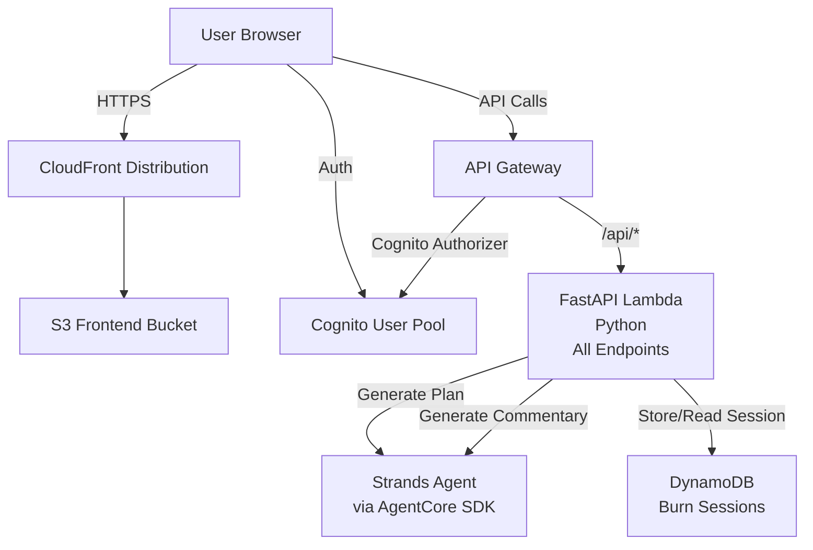

# Design Document: AWS Bill Burner

## Overview

AWS Bill Burner is a satirical web application that simulates "burning" money on AWS resources through an entertaining, real-time visualization experience. The application leverages AWS Bedrock (Claude) to generate creative burn plans and snarky commentary, while using Vue 3 with Apache ECharts for dynamic, neon-styled visualizations.

The system architecture follows a serverless pattern with:
- **Frontend**: Vue 3 SPA with Pinia state management, Vue Router, and Apache ECharts for real-time chart rendering
- **Backend**: Single Python Lambda function running FastAPI for all API endpoints (burn plan generation, status tracking, and roast commentary)
- **Authentication**: AWS Cognito for user management
- **AI Services**: Strands agent with AgentCore SDK for generating burn plans and commentary
- **Infrastructure**: AWS CDK for infrastructure as code, CloudFront for content delivery, S3 for static hosting

The application is purely simulative - no actual AWS resources are provisioned during burns. All cost calculations are based on realistic AWS pricing data, but the "burning" is entirely virtual.

## Architecture

### High-Level Architecture



### Component Interaction Flow

**Burn Plan Generation Flow:**
1. User submits configuration form (amount, style, stupidity level, time horizon)
2. Frontend sends POST /api/burn-plan with parameters
3. API Gateway validates JWT token via Cognito Authorizer
4. API Gateway routes request to FastAPI Lambda
5. FastAPI endpoint handler invokes Strands agent with burn plan generation task and parameters
6. Strands agent (using AgentCore SDK) generates structured burn plan JSON
7. FastAPI handler stores burn session in DynamoDB
8. FastAPI handler returns burn plan and session ID to frontend
9. Frontend navigates to visualization page

**Burn Visualization Flow:**
1. Frontend initializes ECharts with burn plan data
2. Frontend starts animation timer based on time horizon
3. Charts update at regular intervals (e.g., every 100ms for smooth animation)
4. Money remaining decreases according to burn plan timeline
5. Resource allocation charts show services being "spun up"
6. At spending milestones (25%, 50%, 75%, 100%), frontend calls POST /api/roast
7. FastAPI endpoint handler invokes Strands agent to generate commentary
8. Commentary displays on visualization page

**Status Tracking Flow:**
1. Frontend periodically calls GET /api/burn-status with session ID
2. API Gateway routes request to FastAPI Lambda
3. FastAPI endpoint handler retrieves session from DynamoDB
4. FastAPI handler calculates current state based on elapsed time
5. FastAPI handler returns current spending, active resources, and progress
6. Frontend updates charts if needed (for page refresh scenarios)

## Components and Interfaces

### Frontend Components

#### 1. Authentication Components
- **LoginView.vue**: Handles Cognito authentication flow
  - Redirects to Cognito Hosted UI
  - Handles OAuth callback with authorization code
  - Stores JWT tokens in Pinia store
  
- **CallbackView.vue**: OAuth callback handler
  - Exchanges authorization code for tokens
  - Redirects to home/configuration page

#### 2. Configuration Components
- **ConfigurationForm.vue**: Main burn configuration interface
  - **Props**: None (root component)
  - **Emits**: `submit(config: BurnConfig)`
  - **State**:
    - `amount: number` - Money to burn (USD)
    - `burningStyle: 'Horizontal' | 'Vertical'`
    - `stupidityLevel: number` - Range 1-10
    - `timeHorizon: '1h' | '1d' | '1m'` - Optional
  - **Methods**:
    - `validateAmount()`: Ensures positive number
    - `submitConfiguration()`: Sends to backend
  - **Styling**: Neon-themed form with glowing inputs and snarky labels

#### 3. Visualization Components
- **BurnVisualization.vue**: Main visualization container
  - **Props**: `burnPlan: BurnPlan`, `sessionId: string`
  - **State**:
    - `currentTime: number` - Elapsed simulation time
    - `moneyRemaining: number`
    - `activeResources: Resource[]`
    - `roastComments: string[]`
  - **Methods**:
    - `startSimulation()`: Initializes animation timer
    - `updateCharts()`: Recalculates and updates chart data
    - `fetchRoast()`: Calls roast API at milestones
    - `stopSimulation()`: Cleanup on completion

- **MoneyChart.vue**: Real-time money remaining chart
  - **Props**: `moneyRemaining: number`, `totalAmount: number`
  - Uses ECharts line chart with neon glow effects
  - Smooth animations with easing functions

- **ResourceChart.vue**: Resource allocation visualization
  - **Props**: `resources: Resource[]`, `currentTime: number`
  - Uses ECharts stacked area or racing bar chart
  - Shows which services are "active" at current time

- **RoastDisplay.vue**: Commentary display component
  - **Props**: `comments: string[]`
  - Animated text display with neon glow
  - Fades in new comments with transitions

### Backend Components

#### FastAPI Application Structure

The backend is a single Lambda function running FastAPI with Mangum adapter for AWS Lambda integration.

**File Structure**:
```
lambda/
  api/
    __init__.py
    main.py              # FastAPI app initialization
    dependencies.py      # Shared dependencies (auth, DB, AgentCore client)
    models.py            # Pydantic models for request/response
    routers/
      __init__.py
      burn_plan.py       # POST /api/burn-plan endpoint
      burn_status.py     # GET /api/burn-status endpoint
      roast.py           # POST /api/roast endpoint
    services/
      __init__.py
      strands_service.py # Strands agent integration via AgentCore SDK
      session_service.py # DynamoDB session management
    utils/
      __init__.py
      agentcore_client.py # AgentCore SDK wrapper and utilities
```

#### FastAPI Application Entry Point

**File**: `lambda/api/main.py`

```python
from fastapi import FastAPI
from fastapi.middleware.cors import CORSMiddleware
from mangum import Mangum
from .routers import burn_plan, burn_status, roast

app = FastAPI(title="AWS Bill Burner API", version="1.0.0")

# CORS middleware
app.add_middleware(
    CORSMiddleware,
    allow_origins=["*"],  # Configure appropriately for production
    allow_credentials=True,
    allow_methods=["*"],
    allow_headers=["*"],
)

# Include routers
app.include_router(burn_plan.router, prefix="/api", tags=["burn-plan"])
app.include_router(burn_status.router, prefix="/api", tags=["burn-status"])
app.include_router(roast.router, prefix="/api", tags=["roast"])

# Lambda handler using Mangum
handler = Mangum(app)
```

#### 1. Burn Plan Endpoint (FastAPI)
**File**: `lambda/api/routers/burn_plan.py`

**Input**:
```python
{
  "amount": float,
  "burningStyle": "Horizontal" | "Vertical",
  "stupidityLevel": int,  # 1-10
  "timeHorizon": "1h" | "1d" | "1m"  # optional
}
```

**Output**:
```python
{
  "sessionId": str,
  "burnPlan": {
    "totalAmount": float,
    "duration": int,  # seconds
    "resources": [
      {
        "service": str,  # e.g., "EC2 m5.24xlarge"
        "cost": float,
        "startTime": int,  # seconds from start
        "endTime": int,
        "description": str
      }
    ]
  }
}
```

**Logic**:
1. FastAPI dependency injection validates JWT token and extracts user ID
2. Pydantic model validates input parameters
3. Construct Strands agent task with parameters:
   - For "Horizontal": Request many small services
   - For "Vertical": Request few expensive services
   - Stupidity level affects absurdity (e.g., level 10 might suggest "100 NAT Gateways in a VPC with no subnets")
4. Invoke Strands agent via AgentCore SDK with structured output format
5. Parse and validate agent response
6. Ensure total cost matches requested amount (±5% tolerance)
7. Generate session ID (UUID)
8. Store session in DynamoDB with TTL (24 hours)
9. Return burn plan with FastAPI response model

**Strands Agent Integration**:
- Agent task: "burn-plan-generator"
- Temperature: 0.7 (for creativity)
- Max tokens: 4000
- Agent instructions include AWS service catalog and pricing guidelines
- Uses AgentCore SDK for agent orchestration and execution

#### 2. Burn Status Endpoint (FastAPI)
**File**: `lambda/api/routers/burn_status.py`

**Input**:
```python
{
  "sessionId": str
}
```

**Output**:
```python
{
  "sessionId": str,
  "startTime": int,  # Unix timestamp
  "currentTime": int,
  "moneyRemaining": float,
  "moneyBurned": float,
  "activeResources": [
    {
      "service": str,
      "cost": float
    }
  ],
  "progress": float  # 0.0 to 1.0
}
```

**Logic**:
1. FastAPI dependency injection validates JWT token
2. Query parameter validation via Pydantic
3. Retrieve session from DynamoDB
4. Calculate elapsed time since session start
5. Determine which resources are "active" based on timeline
6. Calculate money burned and remaining
7. Return current state with FastAPI response model

#### 3. Roast Endpoint (FastAPI)
**File**: `lambda/api/routers/roast.py`

**Input**:
```python
{
  "sessionId": str,
  "moneyBurned": float,
  "totalAmount": float,
  "stupidityLevel": int,
  "activeResources": [str]  # Service names
}
```

**Output**:
```python
{
  "roast": str  # Snarky commentary
}
```

**Logic**:
1. Retrieve session context from DynamoDB (for stupidity level)
2. Construct Strands agent task with:
   - Amount burned so far
   - Services being used
   - Stupidity level (affects roast severity)
3. Invoke Strands agent via AgentCore SDK for commentary generation
4. Return roast text

**Strands Agent Integration**:
- Agent task: "roast-generator"
- Temperature: 0.9 (for maximum creativity)
- Agent instructions: "You are a snarky AWS cost analyst who roasts people for wasting money. Compare costs to relatable items like burritos, coffee, or Netflix subscriptions. Be witty but not mean."
- Uses AgentCore SDK for agent orchestration and execution

#### 4. AgentCore SDK Utility

**File**: `lambda/api/utils/agentcore_client.py`

The AgentCore SDK utility provides a clean interface for interacting with Strands agents through the AgentCore SDK.

**Class**: `AgentCoreClient`

**Initialization**:
```python
class AgentCoreClient:
    def __init__(self, api_key: str, endpoint: str):
        self.api_key = api_key
        self.endpoint = endpoint
        self.client = agentcore.Client(api_key=api_key, endpoint=endpoint)
```

**Methods**:

1. `generate_burn_plan(config: BurnConfig) -> BurnPlan`
   - Constructs burn plan generation task
   - Invokes Strands agent with appropriate parameters
   - Parses and validates JSON response
   - Returns structured BurnPlan object

2. `generate_roast(context: RoastContext) -> str`
   - Constructs roast generation task
   - Invokes Strands agent with spending context
   - Returns roast commentary text

3. `_invoke_agent(task_name: str, instructions: str, parameters: dict) -> dict`
   - Internal method for agent invocation
   - Handles retries and error handling
   - Logs agent interactions for debugging

**Error Handling**:
- Timeout errors (>30s) raise `AgentTimeoutError`
- Invalid response format triggers retry (max 2 attempts)
- Rate limiting raises `AgentRateLimitError` with retry-after info
- Connection errors raise `AgentConnectionError`

**Configuration**:
- API key loaded from environment variable `AGENTCORE_API_KEY`
- Endpoint URL loaded from environment variable `STRANDS_AGENT_ENDPOINT`
- Default timeout: 30 seconds
- Max retries: 2
- Exponential backoff for retries

### Data Models

#### BurnConfig (Frontend)
```typescript
interface BurnConfig {
  amount: number;
  burningStyle: 'Horizontal' | 'Vertical';
  stupidityLevel: number; // 1-10
  timeHorizon?: '1h' | '1d' | '1m';
}
```

#### BurnPlan (Shared)
```typescript
interface BurnPlan {
  totalAmount: number;
  duration: number; // seconds
  resources: Resource[];
}

interface Resource {
  service: string;
  cost: number;
  startTime: number; // seconds from start
  endTime: number;
  description: string;
}
```

#### BurnSession (DynamoDB)
```typescript
interface BurnSession {
  sessionId: string; // Partition key
  userId: string; // From Cognito JWT
  burnPlan: BurnPlan;
  config: BurnConfig;
  startTime: number; // Unix timestamp
  ttl: number; // DynamoDB TTL (24 hours)
}
```

#### StrandsBurnPlanTask
```python
BURN_PLAN_TASK = {
    "task_name": "burn-plan-generator",
    "instructions": """
You are an AWS cost engineer tasked with creating a plan to waste exactly ${amount} USD on AWS services.

Parameters:
- Burning Style: {style}
  - Horizontal: Use many small, cheap services
  - Vertical: Use few expensive services
- Stupidity Level: {stupidity}/10
  - Low (1-3): Somewhat wasteful but plausible
  - Medium (4-7): Increasingly absurd combinations
  - High (8-10): Completely ridiculous, impossible scenarios
- Time Horizon: {duration}

Generate a JSON array of AWS services with realistic pricing. Each service should have:
- service: AWS service name and instance type
- cost: Dollar amount
- startTime: When to "start" this resource (seconds from 0)
- endTime: When to "stop" this resource
- description: Brief snarky description

Total cost must equal ${amount} (±5%).

Output only valid JSON, no other text.
""",
    "output_format": "json"
}
```

#### StrandsRoastTask
```python
ROAST_TASK = {
    "task_name": "roast-generator",
    "instructions": """
You are a snarky AWS cost analyst. The user has burned ${burned} out of ${total} so far using these services:
{services}

Generate a witty, sarcastic comment about their spending. Compare the cost to relatable items (burritos, coffee, streaming subscriptions, etc.). Keep it under 100 words.

Stupidity level: {stupidity}/10 - adjust roast severity accordingly.
""",
    "output_format": "text"
}
```

### API Endpoints

#### POST /burn-plan
- **Auth**: Cognito JWT required
- **Request**: `BurnConfig`
- **Response**: `{ sessionId: string, burnPlan: BurnPlan }`
- **Errors**:
  - 400: Invalid parameters
  - 401: Unauthorized
  - 500: Bedrock error or internal error

#### GET /burn-status
- **Auth**: Cognito JWT required
- **Query Params**: `sessionId`
- **Response**: `BurnStatus`
- **Errors**:
  - 400: Missing sessionId
  - 401: Unauthorized
  - 404: Session not found
  - 500: Internal error

#### POST /roast
- **Auth**: Cognito JWT required
- **Request**: `{ sessionId: string, moneyBurned: number, activeResources: string[] }`
- **Response**: `{ roast: string }`
- **Errors**:
  - 400: Invalid parameters
  - 401: Unauthorized
  - 500: Bedrock error or internal error

## C
orrectness Properties

*A property is a characteristic or behavior that should hold true across all valid executions of a system—essentially, a formal statement about what the system should do. Properties serve as the bridge between human-readable specifications and machine-verifiable correctness guarantees.*

### Property 1: Valid credentials authenticate successfully
*For any* valid username and password combination, authentication through Cognito should succeed and grant access to the application.
**Validates: Requirements 1.2**

### Property 2: Invalid credentials are rejected
*For any* invalid credential combination (wrong password, non-existent user, malformed input), authentication should fail with an appropriate error message.
**Validates: Requirements 1.3**

### Property 3: Amount validation accepts only positive numbers
*For any* input to the amount field, the system should accept it if and only if it is a positive number greater than zero.
**Validates: Requirements 2.2**

### Property 4: Burning style validation
*For any* burning style input, the system should accept it if and only if it is exactly "Horizontal" or "Vertical".
**Validates: Requirements 2.3**

### Property 5: Stupidity level range validation
*For any* stupidity level input, the system should accept it if and only if it is a number between 1 and 10 (inclusive).
**Validates: Requirements 2.4**

### Property 6: Configuration submission triggers API call
*For any* valid configuration, submitting the form should result in a POST request to /burn-plan with the correct parameters.
**Validates: Requirements 2.5**

### Property 7: Burn plan structure validity
*For any* valid burn configuration, the /burn-plan endpoint should return a JSON object containing sessionId, totalAmount, duration, and an array of resources, where each resource has service, cost, startTime, endTime, and description fields.
**Validates: Requirements 3.2, 7.1**

### Property 8: Horizontal style produces many resources
*For any* burn amount with "Horizontal" style, the generated burn plan should contain more resources with lower individual costs compared to the same amount with "Vertical" style.
**Validates: Requirements 3.4**

### Property 9: Vertical style produces fewer expensive resources
*For any* burn amount with "Vertical" style, the generated burn plan should contain fewer resources with higher individual costs compared to the same amount with "Horizontal" style.
**Validates: Requirements 3.5**

### Property 10: Total cost matches requested amount
*For any* generated burn plan, the sum of all resource costs should equal the user-specified amount within ±5% tolerance.
**Validates: Requirements 3.6**

### Property 11: Money remaining decreases monotonically
*For any* burn simulation, the money remaining value should never increase as time progresses - it should only decrease or stay the same.
**Validates: Requirements 4.2**

### Property 12: Simulation ends at zero
*For any* completed burn simulation, the final money remaining value should be zero (or within rounding tolerance of zero).
**Validates: Requirements 4.5**

### Property 13: Resource charts display active resources
*For any* point in time during a burn simulation, the resource chart should display exactly those resources whose startTime ≤ currentTime < endTime.
**Validates: Requirements 4.3**

### Property 14: Milestones trigger roast generation
*For any* burn simulation, when spending reaches 25%, 50%, 75%, or 100% of the total amount, the system should invoke the roast API.
**Validates: Requirements 5.1**

### Property 15: Roast commentary displays in order
*For any* sequence of roast comments generated during a simulation, they should be displayed in chronological order without overlapping.
**Validates: Requirements 5.3, 5.4**

### Property 16: Simulation uses plan data not actual resources
*For any* burn simulation, all cost calculations and resource displays should be derived from the burn plan data structure, not from querying actual AWS resources.
**Validates: Requirements 6.2**

### Property 17: Displayed costs match AWS pricing
*For any* AWS service in a burn plan, the cost should match realistic AWS pricing within a reasonable tolerance (±10% to account for regional variations).
**Validates: Requirements 6.3**

### Property 18: Burn status API returns valid state
*For any* valid session ID, the /burn-status endpoint should return a JSON object containing sessionId, startTime, currentTime, moneyRemaining, moneyBurned, activeResources array, and progress (0.0 to 1.0).
**Validates: Requirements 7.2**

### Property 19: Roast API returns commentary
*For any* valid roast request with sessionId and spending data, the /roast endpoint should return a JSON object containing a non-empty roast string.
**Validates: Requirements 7.3**

### Property 20: API errors return appropriate status codes
*For any* invalid API request (missing parameters, invalid session ID, malformed data), the system should return an appropriate HTTP error code (400, 401, 404, or 500) with an error message.
**Validates: Requirements 7.4**

### Property 21: CORS headers present on all responses
*For any* API response, the response headers should include Access-Control-Allow-Origin, Access-Control-Allow-Methods, and Access-Control-Allow-Headers.
**Validates: Requirements 7.5**

## Error Handling

### Frontend Error Handling

**Authentication Errors:**
- Cognito authentication failures display user-friendly error messages
- Session expiration redirects to login with a notification
- Network errors during auth show retry option

**Form Validation Errors:**
- Real-time validation feedback on amount field (must be positive)
- Burning style selection enforced via radio buttons/dropdown
- Stupidity level constrained by slider component
- Form submission disabled until all fields valid

**API Errors:**
- Network failures show "Unable to connect" message with retry button
- 400 errors display validation feedback
- 401 errors redirect to login
- 500 errors show "Something went wrong" with support contact
- Timeout errors (>30s) show loading state then error

**Visualization Errors:**
- Missing burn plan data redirects to configuration page
- Chart rendering errors display fallback message
- Roast API failures don't block visualization (graceful degradation)

### Backend Error Handling

**Lambda Error Handling:**
- All Lambda functions use try-except blocks with proper logging
- Strands agent failures return 500 with generic error message (don't expose AI details)
- DynamoDB errors (throttling, unavailable) return 503 with retry-after header
- Input validation errors return 400 with specific field errors
- Missing/expired sessions return 404

**Strands Agent Error Handling:**
- Timeout errors (>30s) return 500
- Invalid response format from agent triggers retry (max 2 attempts)
- If agent returns plan with wrong total cost, Lambda adjusts resource costs proportionally
- Rate limiting errors return 429 with retry-after header
- AgentCore SDK connection errors trigger fallback or retry logic

**DynamoDB Error Handling:**
- Conditional check failures (concurrent updates) return 409
- Item not found returns 404
- Throttling errors trigger exponential backoff (max 3 retries)

### Error Logging

- All errors logged to CloudWatch with:
  - Request ID for tracing
  - User ID (from JWT)
  - Error type and message
  - Stack trace for 500 errors
- Frontend errors logged to browser console (development) and error tracking service (production)

## Testing Strategy

### Unit Testing

**Frontend Unit Tests (Vitest + Vue Test Utils):**
- Component rendering tests for all Vue components
- Form validation logic tests
- Chart data transformation tests
- API client mock tests
- Router navigation tests
- Pinia store state management tests

**Backend Unit Tests (pytest):**
- Lambda handler input validation tests
- Strands agent task construction tests
- AgentCore SDK integration tests (mocked)
- DynamoDB query/put operation tests (mocked)
- Cost calculation logic tests
- Session management tests
- Error handling tests for each error scenario

**Key Unit Test Examples:**
- Test that amount validation rejects negative numbers, zero, and non-numeric input
- Test that burn plan cost sum calculation is accurate
- Test that resource timeline filtering works correctly
- Test that milestone detection (25%, 50%, 75%, 100%) triggers at right times
- Test that CORS headers are included in all responses

### Property-Based Testing

Property-based testing will be used to verify universal properties across many randomly generated inputs. We will use:
- **Frontend**: fast-check (TypeScript property testing library)
- **Backend**: Hypothesis (Python property testing library)

**Configuration:**
- Each property test should run a minimum of 100 iterations
- Each property-based test must be tagged with a comment explicitly referencing the correctness property from this design document
- Tag format: `// Feature: aws-bill-burner, Property {number}: {property_text}`

**Property Test Examples:**

1. **Property 3: Amount validation** - Generate random numbers (positive, negative, zero, floats, integers, NaN, Infinity) and verify only positive numbers are accepted

2. **Property 10: Total cost matches** - Generate random burn configurations, call burn-plan API, verify sum of resource costs equals requested amount within tolerance

3. **Property 11: Money decreases monotonically** - Generate random burn plans, simulate time progression, verify money remaining never increases

4. **Property 13: Active resources** - Generate random burn plans and random time points, verify displayed resources match those active at that time

5. **Property 20: API error codes** - Generate random invalid requests (missing fields, wrong types, invalid values) and verify appropriate error codes returned

### Integration Testing

**API Integration Tests:**
- End-to-end tests for each API endpoint
- Test with real Strands agent calls (using test environment)
- Test with real DynamoDB (using test table)
- Verify complete request/response cycles
- Test authentication flow with Cognito
- Test AgentCore SDK integration and agent task execution

**Frontend-Backend Integration:**
- Test complete user flows from configuration to visualization
- Test WebSocket/polling for real-time updates
- Test error scenarios across the stack

### Manual Testing

**Visual/UX Testing:**
- Verify neon aesthetic is applied consistently
- Test chart animations for smoothness
- Verify snarky tone in all text
- Test responsive design on different screen sizes
- Verify accessibility (keyboard navigation, screen readers)

**AI Output Quality:**
- Review Strands agent-generated burn plans for realism and humor
- Review roast commentary for appropriate snark level
- Test different stupidity levels produce noticeably different outputs
- Verify agent task execution produces consistent, structured outputs

## Infrastructure

### AWS CDK Stack Updates

The existing `R2RStack` will be extended with:

**1. DynamoDB Table for Burn Sessions:**
```typescript
const burnSessionsTable = new dynamodb.Table(this, 'BurnSessionsTable', {
  tableName: 'burn-sessions',
  partitionKey: { name: 'sessionId', type: dynamodb.AttributeType.STRING },
  billingMode: dynamodb.BillingMode.PAY_PER_REQUEST,
  timeToLiveAttribute: 'ttl',
  removalPolicy: cdk.RemovalPolicy.DESTROY,
});
```

**2. FastAPI Lambda Function:**
```typescript
// Single FastAPI Lambda for all endpoints
const apiFunction = new lambda.Function(this, 'ApiFunction', {
  functionName: 'bill-burner-api',
  runtime: lambda.Runtime.PYTHON_3_11,
  handler: 'api.main.handler',
  code: lambda.Code.fromAsset('lambda'),
  timeout: cdk.Duration.seconds(30),
  memorySize: 512,
  environment: {
    SESSIONS_TABLE: burnSessionsTable.tableName,
    STRANDS_AGENT_ENDPOINT: process.env.STRANDS_AGENT_ENDPOINT || '',
    AGENTCORE_API_KEY: process.env.AGENTCORE_API_KEY || '',
  },
});

// Grant permissions
burnSessionsTable.grantReadWriteData(apiFunction);
// Note: Strands agent access via AgentCore SDK is managed via API key, not IAM
```

**3. API Gateway Routes:**
```typescript
// Single proxy integration for all /api/* routes
const apiResource = api.root.addResource('api');
const proxyResource = apiResource.addResource('{proxy+}');

proxyResource.addMethod('ANY', 
  new apigateway.LambdaIntegration(apiFunction), {
  authorizer: cognitoAuthorizer,
  authorizationType: apigateway.AuthorizationType.COGNITO,
});

// Also handle /api directly
apiResource.addMethod('ANY',
  new apigateway.LambdaIntegration(apiFunction), {
  authorizer: cognitoAuthorizer,
  authorizationType: apigateway.AuthorizationType.COGNITO,
});
```

### Frontend Dependencies

Add to `frontend/package.json`:
```json
{
  "dependencies": {
    "echarts": "^5.4.3",
    "vue-echarts": "^6.6.1"
  },
  "devDependencies": {
    "@vitest/ui": "^1.0.0",
    "vitest": "^1.0.0",
    "@vue/test-utils": "^2.4.0",
    "fast-check": "^3.15.0"
  }
}
```

### Backend Dependencies

Create `lambda/requirements.txt`:
```
fastapi>=0.104.0
mangum>=0.17.0
boto3>=1.34.0
pydantic>=2.5.0
agentcore>=1.0.0
hypothesis>=6.92.0
pytest>=7.4.0
requests>=2.31.0
```

## Deployment

### Build Process

1. **Frontend Build:**
   ```bash
   cd frontend
   npm install
   npm run build
   ```

2. **Lambda Package:**
   ```bash
   cd lambda
   pip install -r requirements.txt -t .
   zip -r function.zip .
   ```

3. **CDK Deploy:**
   ```bash
   npm run deploy
   ```

### Environment Configuration

**Frontend `.env`:**
```
VITE_API_URL=https://api.wehavetoomuch.com
VITE_COGNITO_USER_POOL_ID=<from CDK output>
VITE_COGNITO_CLIENT_ID=<from CDK output>
VITE_COGNITO_DOMAIN=<from CDK output>
```

**Lambda Environment Variables:**
- `SESSIONS_TABLE`: DynamoDB table name
- `STRANDS_AGENT_ENDPOINT`: Strands agent API endpoint URL
- `AGENTCORE_API_KEY`: API key for AgentCore SDK authentication
- `AWS_REGION`: Deployment region

### Monitoring

**CloudWatch Metrics:**
- Lambda invocation count, duration, errors
- API Gateway request count, latency, 4xx/5xx errors
- DynamoDB read/write capacity, throttles
- Strands agent invocation count, latency, errors (custom metrics)

**CloudWatch Alarms:**
- Lambda error rate > 5%
- API Gateway 5xx rate > 1%
- DynamoDB throttling events
- Strands agent timeout rate > 10%
- AgentCore SDK connection failures

**Cost Monitoring:**
- Strands agent API costs (primary cost driver)
- Lambda execution costs
- DynamoDB costs
- CloudFront/S3 costs
- AgentCore SDK usage costs

## Security Considerations

**Authentication:**
- All API endpoints require valid Cognito JWT
- JWT validation handled by API Gateway Cognito Authorizer
- Session IDs are UUIDs to prevent enumeration

**Authorization:**
- Users can only access their own burn sessions
- Lambda functions validate userId from JWT matches session owner

**Data Privacy:**
- No sensitive data stored (just simulation data)
- Sessions auto-expire after 24 hours (DynamoDB TTL)
- No PII collected beyond email (from Cognito)

**Input Validation:**
- All user inputs validated on frontend and backend
- Bedrock prompts sanitized to prevent injection
- API rate limiting via API Gateway throttling

**Strands Agent Safety:**
- Agent task instructions constrain AI output to safe, appropriate content
- AI responses validated for structure before returning to frontend
- No user input directly passed to agent without sanitization
- AgentCore SDK provides additional safety guardrails

## Performance Considerations

**Frontend Performance:**
- Chart updates throttled to 60fps max
- Lazy loading for visualization page
- Debounced form validation
- Optimized bundle size with code splitting

**Backend Performance:**
- Lambda cold start mitigation: provisioned concurrency for burn-plan function
- DynamoDB on-demand billing for cost efficiency
- Strands agent streaming responses (if supported) for faster perceived performance
- API Gateway caching for burn-status endpoint (5-second TTL)
- AgentCore SDK connection pooling for reduced latency

**Scalability:**
- Serverless architecture scales automatically
- DynamoDB auto-scales with on-demand mode
- CloudFront CDN for global frontend delivery
- API Gateway handles 10,000 requests/second default limit

## Future Enhancements

**Phase 2 Features:**
- WebSocket support for true real-time updates (replace polling)
- Historical burn tracking (save past burns to DynamoDB)
- Leaderboard of biggest burns
- Social sharing of burn visualizations
- Export burn plan as PDF/image

**Phase 3 Features:**
- Multi-cloud support (Azure, GCP burn plans)
- Team burns (collaborative burning)
- Burn challenges/achievements
- Custom resource catalogs
- API for programmatic burn generation

## Neon Aesthetic Implementation

### Color Palette

**Primary Neon Colors:**
- Electric Blue: `#00F0FF` (primary accent)
- Hot Pink: `#FF006E` (secondary accent)
- Neon Green: `#39FF14` (success/active states)
- Neon Purple: `#BC13FE` (tertiary accent)
- Neon Orange: `#FF9500` (warnings/highlights)

**Background Colors:**
- Dark Base: `#0A0A0F` (main background)
- Slightly Lighter: `#1A1A2E` (cards/panels)
- Darkest: `#000000` (deep shadows)

**Text Colors:**
- Primary Text: `#FFFFFF` (white)
- Secondary Text: `#B0B0C0` (muted)
- Glow Text: Use primary neon colors with text-shadow

### CSS Effects

**Glow Effects:**
```css
.neon-glow {
  text-shadow: 
    0 0 5px currentColor,
    0 0 10px currentColor,
    0 0 20px currentColor,
    0 0 40px currentColor;
}

.neon-box {
  box-shadow:
    0 0 5px currentColor,
    0 0 10px currentColor,
    inset 0 0 5px currentColor;
  border: 2px solid currentColor;
}
```

**Button Styles:**
```css
.neon-button {
  background: transparent;
  border: 2px solid var(--neon-color);
  color: var(--neon-color);
  text-shadow: 0 0 10px currentColor;
  transition: all 0.3s ease;
}

.neon-button:hover {
  background: var(--neon-color);
  color: #0A0A0F;
  box-shadow: 0 0 20px var(--neon-color);
}
```

**Chart Styling:**
- Line charts: Neon-colored lines with glow effect
- Area charts: Gradient fills from neon color to transparent
- Axes: Thin neon-colored lines
- Grid: Subtle dark lines with slight neon tint
- Tooltips: Dark background with neon border and glow

### Animation Principles

**Transitions:**
- Use `ease-in-out` for smooth, organic feel
- Duration: 200-300ms for UI interactions, 500-1000ms for chart updates
- Glow intensity increases on hover/active states

**Chart Animations:**
- Money remaining: Smooth line animation with trailing glow
- Resource bars: Slide in from left with glow pulse
- Milestone markers: Pulse effect when reached

**Loading States:**
- Pulsing neon glow effect
- Animated border that travels around element
- Rotating neon ring spinner

### Typography

**Fonts:**
- Headings: Bold, sans-serif with letter-spacing for neon sign effect
- Body: Clean, readable sans-serif (e.g., Inter, Roboto)
- Monospace: For numbers and technical data (e.g., Fira Code)

**Text Effects:**
- Headings: Full neon glow effect
- Important numbers: Neon color with subtle glow
- Body text: White or muted for readability
- Links: Neon color with underline glow on hover
